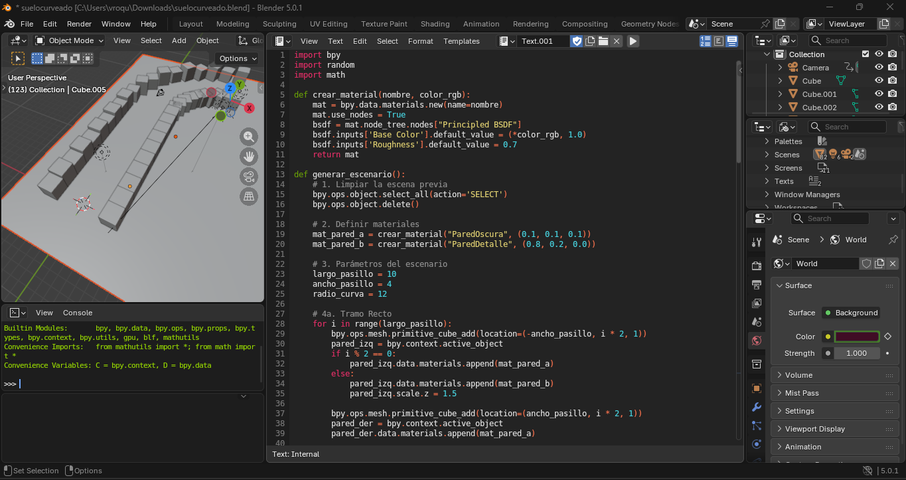

# PRACTICA - Generación de Escenario y Animación en Blender con Python

## Introducción

En esta práctica se desarrolla un script en Python utilizando la API `bpy` de Blender para generar automáticamente un escenario tipo pasillo y crear una animación de cámara.

El objetivo es aplicar programación para automatizar la creación de objetos, asignar materiales y generar movimiento mediante keyframes.

---

## Código en Python

```python
import bpy
import random
import math

# -----------------------------------
# FUNCIÓN PARA CREAR MATERIAL
# -----------------------------------
def crear_material(nombre, color_rgb):
    mat = bpy.data.materials.new(name=nombre)
    mat.use_nodes = True
    bsdf = mat.node_tree.nodes["Principled BSDF"]
    bsdf.inputs["Base Color"].default_value = (*color_rgb, 1)
    bsdf.inputs["Roughness"].default_value = 0.7
    return mat


# -----------------------------------
# FUNCIÓN PARA GENERAR ESCENARIO
# -----------------------------------
def generar_escenario():

    # Limpiar escena
    bpy.ops.object.select_all(action='SELECT')
    bpy.ops.object.delete(use_global=False)

    # Materiales
    mat_pared_a = crear_material("ParedOscura", (0.1, 0.1, 0.1))
    mat_pared_b = crear_material("ParedDetalle", (0.8, 0.2, 0.0))

    # Parámetros
    largo_pasillo = 10
    ancho_pasillo = 4
    radio_curva = 12

    # -----------------------------------
    # TRAMO RECTO
    # -----------------------------------
    for i in range(largo_pasillo):
        bpy.ops.mesh.primitive_cube_add(location=(-ancho_pasillo, i * 2, 1))
        pared_izq = bpy.context.active_object
        pared_izq.scale = (0.2, 1, 2)
        pared_izq.data.materials.append(mat_pared_a)

        bpy.ops.mesh.primitive_cube_add(location=(ancho_pasillo, i * 2, 1))
        pared_der = bpy.context.active_object
        pared_der.scale = (0.2, 1, 2)
        pared_der.data.materials.append(mat_pared_a)

    # -----------------------------------
    # CREAR CÁMARA
    # -----------------------------------
    bpy.ops.object.camera_add(location=(0, -5, 2))
    cam = bpy.context.active_object
    cam.rotation_euler = (math.radians(75), 0, 0)

    bpy.context.scene.camera = cam

    # -----------------------------------
    # ANIMACIÓN DE CÁMARA
    # -----------------------------------
    cam.location = (0, -5, 2)
    cam.keyframe_insert(data_path="location", frame=1)

    cam.location = (0, 20, 2)
    cam.keyframe_insert(data_path="location", frame=120)

    bpy.context.scene.frame_start = 1
    bpy.context.scene.frame_end = 120


# Ejecutar función
generar_escenario()
```

---

## Resultado en Blender



---

## Explicación del Código

### 1. Importación de librerías

- `bpy`: Permite controlar Blender mediante Python.
- `random`: Permite generar valores aleatorios (aunque en este script no se usa directamente).
- `math`: Se utiliza para trabajar con ángulos en radianes.

---

### 2. Función crear_material()

Esta función genera un material con:

- Color base RGB
- Nivel de rugosidad (Roughness)

Se utiliza el nodo **Principled BSDF**, que es el shader estándar en Blender.

---

### 3. Función generar_escenario()

Esta función construye todo el entorno automáticamente.

#### Limpieza de escena
Se eliminan todos los objetos existentes para comenzar desde cero.

#### Creación de materiales
Se crean materiales para las paredes del pasillo.

#### Parámetros
- `largo_pasillo`: Número de segmentos del pasillo.
- `ancho_pasillo`: Separación entre paredes.
- `radio_curva`: Variable preparada para futuras expansiones.

---

### 4. Creación del tramo recto

Se utiliza un ciclo `for` que repite la creación de cubos.

Cada iteración:

- Crea una pared izquierda.
- Crea una pared derecha.
- Ajusta su escala.
- Asigna material.

Esto genera un pasillo largo y simétrico.

---

### 5. Creación de la cámara

Se añade una cámara y se rota 75 grados en el eje X para apuntar hacia el pasillo.

Se establece como cámara activa de la escena.

---

### 6. Animación

Se insertan keyframes:

- Frame 1 → posición inicial
- Frame 120 → posición final

La cámara se mueve automáticamente a lo largo del pasillo creando una animación.

---

## Conclusión

Este ejercicio demuestra cómo la programación en Blender permite automatizar la creación de escenarios y generar animaciones mediante keyframes.

La combinación de estructuras de control, funciones y parámetros facilita la construcción de escenas dinámicas sin necesidad de modelado manual.
